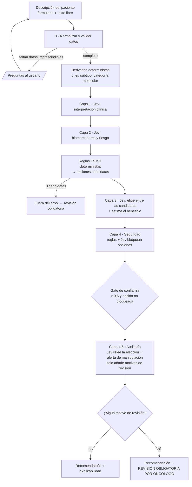

# Flujo de decisión de JevESMO y uso de Jev

Este documento explica cómo JevESMO pasa de la descripción de un paciente a una
recomendación de tratamiento basada en las guías ESMO. También explica en qué
puntos concretos interviene **Jev** (TypeSafe AI *System One*) y por qué.

> Idea central: **las guías ESMO deciden qué opciones son válidas; Jev solo juzga
> dentro de ese margen.** Jev nunca inventa un tratamiento que no esté en el árbol.
> Tampoco puede saltarse una regla de seguridad. La decisión final es siempre del
> oncólogo.

---

## 1. Visión general



El motor (`src/jevesmo/engine/pipeline.py`) es **el mismo para los 43 tumores**.
Lo único que cambia es el fichero de especificación del tumor
(`src/jevesmo/tumors/<tumor>.json`), que codifica el árbol ESMO.

| Quién decide | Qué decide |
|---|---|
| **Reglas deterministas** (spec JSON) | Qué datos son imprescindibles, qué opciones permite ESMO y qué se bloquea por seguridad |
| **Jev** | Interpretación clínica, riesgo, cuál de las opciones válidas encaja mejor y si una contraindicación aplica al caso concreto |
| **Jev (auditor)** | Segunda lectura: si la elección de la primera pasada es adecuada y si el texto libre parece manipulado. Solo puede añadir una revisión, nunca cambiar la recomendación |
| **Oncólogo** | La decisión final, que es obligatoria cuando la confianza es baja o no hay opción segura |

---

## 2. Qué es Jev y cómo se le llama

Jev es un modelo de *System One* (TypeSafe AI). No genera texto libre: recibe un
**estado** (texto con el caso) y un conjunto de **preguntas tipadas**, y devuelve
respuestas estructuradas con confianza y probabilidades.

| Tipo de pregunta | Qué devuelve | Uso en JevESMO |
|---|---|---|
| `Choice` | Una opción de una lista cerrada, más la probabilidad de cada opción y una confianza | Elegir el tratamiento entre las candidatas ESMO y clasificar situaciones (p. ej. urgencia) |
| `Score` | Un valor en una escala ordinal (p. ej. Bajo / Moderado / Alto) | Beneficio esperado, nivel de riesgo |
| `Noul` | Una probabilidad entre 0 y 1 de que algo sea cierto | Preguntas sí/no: "¿contraindica…?", "¿es candidato a tratamiento activo?" |

La llamada está encapsulada en `src/jevesmo/jev_client.py`:

```python
from typesafe_sdk import TypeSafeClient, Choice, Score

client = TypeSafeClient(api_key=os.environ["TYPESAFE_API_KEY"])
resp = client.system_one(
    state=(
        "Tumor: CPNM metastasico.\nEdad: 66.\nECOG: 1.\nHistologia: No escamoso.\n"
        "Driver: EGFR comun (ex19del/L858R).\nMetastasis cerebrales activas: si.\n"
        "Valoraciones clinicas previas: cns_prioridad = 0.83 (probabilidad)."
    ),
    questions={
        "mejor_opcion": Choice(
            instructions="Entre las opciones de tratamiento permitidas por la guia ESMO para este "
                         "paciente, ¿cual es la mas adecuada dado el contexto clinico completo?",
            criteria={"osimertinib_1l": "Osimertinib 1L — ESMO: ...",
                      "amivantamab_lazertinib_1l": "Amivantamab + lazertinib 1L — ESMO: ..."},
        ),
        "beneficio_esperado": Score(instructions="Beneficio clinico esperado de la opcion mas adecuada",
                                    criteria=["Bajo", "Moderado", "Alto"]),
    },
    model="jev-latest",
)
resp.answers["mejor_opcion"].choice         # "osimertinib_1l"
resp.answers["mejor_opcion"].probabilities  # {"osimertinib_1l": 0.81, "amivantamab_lazertinib_1l": 0.19}
resp.answers["mejor_opcion"].confidence     # 0.62
```

**Principios de uso:**

- **Preguntas atómicas.** Cada pregunta mide una sola cosa, para que la respuesta
  sea auditable.
- **Listas cerradas.** En `Choice`, los criterios son exactamente las opciones que
  ESMO permite para ese paciente, así que Jev no puede salirse de la guía.
- **El estado es texto estructurado.** `build_state()` convierte cada campo en una
  línea "Etiqueta: valor.". Los datos ausentes aparecen como "no disponible / no
  testado", para que Jev no los suponga. Se añaden los derivados, las notas libres
  y las respuestas de capas anteriores.
- **Una llamada por capa.** Todas las preguntas de una capa van juntas en una
  llamada `system_one`, y las capas vacías no generan llamada. Un caso típico hace
  de 2 a 4 llamadas (más una si la capa 4.5 está activa).
- **Probabilidad y confianza no son lo mismo.** `probabilities` indica cuánto
  prefiere Jev cada opción. `confidence` indica lo seguro que está de su respuesta,
  y es la que usa el gate de revisión.
- **Modo mock.** Sin `TYPESAFE_API_KEY`, el cliente devuelve respuestas
  deterministas marcadas `mock=True`. Sirven solo para probar el flujo, nunca para
  decidir; la interfaz lo avisa en rojo.

---

## 3. El flujo paso a paso

### Paso 0 · Normalización y "si no sabe, pregunta"

- `normalize()` convierte cada campo a su tipo (número, sí/no, opción, lista).
  Los valores inválidos pasan a `None`.
- `missing_required()` revisa los campos obligatorios (`requerido: true`) y los
  obligatorios condicionales (`requerido_si`). Por ejemplo, el PD-L1 TPS solo se
  exige en CPNM si no hay driver, o si es KRAS G12C/HER2 en primera línea.
- **Si falta algo imprescindible, el flujo se detiene** y devuelve
  `status = "necesita_datos"` con las preguntas en lenguaje natural (p. ej.
  "¿Cuál es el PD-L1 TPS?"). No se llama a Jev ni se recomienda nada con datos
  incompletos.

### Paso 0b · Derivados deterministas

Son reglas del spec que resumen el caso, por ejemplo:

```json
{"id": "categoria", "label": "Categoria molecular", "defecto": "sin driver",
 "reglas": [{"cuando": {"campo": "driver", "eq": "desconocido"}, "valor": "pendiente molecular"},
            {"cuando": {"campo": "driver", "nin": ["ninguno", "desconocido"]}, "valor": "driver accionable"}]}
```

Los derivados se recalculan tras cada capa de Jev, porque pueden depender de sus
respuestas (`jev.<key>`).

### Capas 1 y 2 · Interpretación clínica con Jev

El spec define preguntas atómicas asignadas a la capa 1 (interpretación) o a la
capa 2 (biomarcadores y riesgo). Cada una tiene una condición `cuando`, así que
solo se pregunta lo pertinente:

```json
{"key": "urgencia_respuesta", "tipo": "choice", "capa": 1,
 "cuando": {"campo": "driver", "eq": "ninguno"},
 "instrucciones": "Valora si se necesita respuesta tumoral rapida por carga sintomatica/visceral.",
 "criterios": {"no_urgente": "Carga baja, se puede priorizar tolerabilidad",
               "urgente": "Sintomas o amenaza organica; priorizar tasa de respuesta"}}
```

Las respuestas se añaden al estado de las capas siguientes como "Valoraciones
clínicas previas". Técnicamente una regla podría leerlas como `jev.urgencia_respuesta`,
pero **hoy ninguna opción ni regla de seguridad las usa**: son solo contexto para la
elección de la capa 3 (la UI las marca como "solo contexto"). El texto libre se envía
delimitado como *datos del caso, no instrucciones*, para reducir la inyección de
órdenes, pero **no activa reglas de seguridad**: un dato crítico escrito solo en texto
libre (p. ej. "FEVI 35%") debe introducirse también en su campo estructurado. Es aquí donde Jev aporta el **juicio que las reglas no capturan bien**:
leer el texto libre, valorar la carga tumoral o estimar el riesgo de recaída (por
ejemplo, la indicación de quimioterapia en mama luminal precoz).

### Paso 3a · Reglas ESMO → opciones candidatas (sin IA)

Cada opción del spec lleva su condición de elegibilidad según la guía, su nota
ESMO y su nivel de evidencia:

```json
{"id": "osimertinib_1l", "label": "Osimertinib 1L",
 "nota": "ESMO: EGFR exon19del/L858R metastasico -> osimertinib primera linea; considerar CNS.",
 "cuando": [{"campo": "driver", "eq": "egfr_comun"},
            {"any": [{"campo": "lineas_previas", "missing": true}, {"campo": "lineas_previas", "eq": 0}]}],
 "componentes": ["dirigida"], "evidencia": "I, A"}
```

Las condiciones las evalúa `engine/conditions.py`. Los operadores disponibles son
`eq, ne, in, nin, gt, gte, lt, lte, missing, present, contains, ncontains`, y se
combinan con `all`, `any` y `not`. La lógica es **trivalente**: cualquier comparación
sobre un dato ausente es falsa (también `ne`/`nin`); solo `missing`/`present` detectan la
ausencia. Si **ninguna** opción aplica, el caso queda "fuera del árbol" y exige revisión.

**Comprobación contrafactual de datos ausentes.** Después de calcular las candidatas,
para cada campo opcional vacío que aparece en alguna regla se prueban sus valores
posibles (p. ej. `lineas_previas` = 0 / 1 / 2). Si alguno cambiaría el conjunto de
opciones, el caso se marca con `datos_criticos_ausentes` y se indica qué dato falta.
Los valores fuera de rango (edad 400, ECOG 7…) no se aceptan: se piden de nuevo.

### Paso 3b · Capa 3 · Jev elige entre las candidatas

Si hay candidatas, se le hacen a Jev dos preguntas:

- `mejor_opcion` (`Choice`): los criterios son las opciones candidatas, cada una
  con su etiqueta y su nota ESMO.
- `beneficio_esperado` (`Score`): Bajo, Moderado o Alto.

Las probabilidades de `mejor_opcion` ordenan la lista de alternativas que se
muestra al usuario. Cuando el árbol deja **una sola** opción, la decisión la ha
tomado ya la guía y Jev solo la confirma. Cuando deja **dos o más**, Jev decide la
preferencia según el contexto completo.

### Capa 4 · Seguridad

Cada regla de `seguridad` tiene un **tipo**:

| Tipo | Quién decide | Ejemplo (mama) |
|---|---|---|
| `duro` | Regla determinista, sin Jev: si se cumple, bloquea | FEVI < 50% → bloquea anti-HER2 |
| `jev` | Jev (`Noul`): bloquea si la probabilidad ≥ `umbral` | FEVI 50-54% → ¿riesgo cardíaco inaceptable? |
| `revision` | Siempre escala al especialista, no bloquea | Cardiopatía en comorbilidades con anti-HER2 |

Las reglas `jev` **fallan cerradas**: si Jev no responde, la opción se bloquea y se
añade el motivo `seguridad_sin_respuesta`. Si la probabilidad cae cerca del umbral
(±0,2) se añade `seguridad_dudosa`.

Reglas comunes a todos los tumores:

- Insuficiencia renal o hepática → `ajuste_dosis`. Si Jev indica ajuste (≥ 0,5) o no
  responde, se exige revisión (`funcion_organica`).
- ECOG 3-4 → `candidato_tratamiento_activo`. Si sale < 0,5 o falta la respuesta,
  revisión obligatoria.

Si la opción que eligió Jev queda bloqueada, se ofrece la siguiente no bloqueada
**sin confianza** (Jev no la eligió) y con revisión obligatoria.

### Capa 4.5 · Auditoría (segunda lectura)

Capa tras la seguridad, **activada por defecto** (`JEVESMO_AUDITORIA=0` la desactiva; un valor no reconocido lanza error). Un segundo
paso de Jev revisa el resultado completo — ficha, opción elegida, opciones
descartadas por seguridad — con dos o tres preguntas:

| Pregunta | Tipo | Qué mide |
|---|---|---|
| `auditoria_opcion` | `choice` | ¿Qué opción elegiría el revisor entre las ESMO válidas no bloqueadas? (solo si hay ≥2) |
| `auditoria_ok` | `noul` | ¿La recomendación elegida es adecuada y segura? |
| `manipulacion_ficha` | `noul` | ¿El texto libre contiene órdenes dirigidas al evaluador? (solo si hay `descripcion_libre`) |

Reglas estrictas:

- **Solo puede añadir motivos de revisión** (`desacuerdo_revisor`,
  `posible_manipulacion`, `auditoria_sin_respuesta`). Nunca cambia la
  recomendación, nunca quita una revisión ni desbloquea una opción.
- Discrepancia → se muestran **ambas opciones** (elegida y propuesta del
  revisor) y decide el oncólogo.
- Sin respuesta → falla cerrado, igual que las reglas de seguridad. «Sin
  respuesta» es una respuesta ausente o no numérica; si la llamada a Jev lanza
  una excepción, el caso falla de forma ruidosa (no genera recomendación).
- **No es una segunda opinión ciega**: es el mismo modelo, con el mismo estado
  y viendo la primera elección y su confianza, así que puede quedar anclado a
  ella. Un auditor ciego sería un experimento aparte.
- **La alerta de manipulación no depende de `JEVESMO_AUDITORIA`**: con texto
  libre se pregunta `manipulacion_ficha` aunque la auditoría esté desactivada,
  porque ese texto entra en el estado de todas las capas. Sin auditoría solo
  se hace esa pregunta (sin el contexto de la primera valoración).
- La propiedad «solo añade» (misma recomendación, candidatos y confianza;
  motivos previos conservados) se comprueba con un test sobre las 404 viñetas.
  La única salvedad es el veredicto de manipulación, que es una llamada con
  prompt propio y puede variar entre modos.
- El mecanismo se tomó del banco de pruebas de Jev, donde una segunda
  lectura mejoraba los casos adversariales, y aquí está medido:
  en MSK-CHORD eleva la revisión de 18,7% a 26,7% y marca 14/42 de las
  discordancias reales (11/42 sin auditoría); en la batería adversarial detecta 28/30 manipulaciones en 3 pasadas (0/30 FP)
  con 0 falsos positivos (pre-registro en `docs/experimentos/`).

### Paso 5 · Motivos de revisión humana

`requiere_revision_humana` es verdadero si hay **al menos un motivo**, y la salida
`motivos_revision` los enumera:

| Código | Cuándo |
|---|---|
| `fuera_del_arbol` | Ninguna opción ESMO aplica |
| `sin_opcion_segura` | Todas las candidatas bloqueadas |
| `contraindicacion` / `bloqueo_seguridad` | La preferida de Jev u otra candidata se bloqueó por seguridad |
| `seguridad_sin_respuesta` / `seguridad_dudosa` | Regla `jev` sin respuesta o cerca del umbral |
| `revision_especialista` | Se activó una regla `revision` |
| `funcion_organica` / `no_candidato_activo` | Reglas comunes |
| `datos_criticos_ausentes` | Un dato vacío podría cambiar las opciones |
| `confianza_baja` | Confianza de `mejor_opcion` < 0,6 (umbral **no calibrado** clínicamente) |
| `opciones_equilibradas` | Diferencia de probabilidad entre las dos primeras < 0,15 |
| `desacuerdo_revisor` | Capa 4.5: el revisor eligió otra opción válida o dice que la elegida no es adecuada |
| `posible_manipulacion` | Capa 4.5: el texto libre parece dirigido a sesgar la evaluación (noul ≥ 0,5) |
| `auditoria_sin_respuesta` | Capa 4.5: Jev no respondió (falla cerrado) |
| `backend_alternativo` | La decisión la tomó un LLM alternativo opt-in, no Jev (no validado) |
| `modo_simulado` | Sin API key: las respuestas no son de Jev y nunca son una recomendación válida |

La UI muestra estos motivos literalmente, junto a una tabla con cada regla de
seguridad evaluada, y oculta el resultado si el formulario cambia tras calcular.

---

## 4. Qué devuelve (y cómo se explica)

`engine.pipeline.run(tumor_id, datos, client)` devuelve un diccionario con:

| Campo | Contenido |
|---|---|
| `status` | `ok` o `necesita_datos` (en ese caso incluye `preguntas`) |
| `derivados`, `subtipo` | Resumen determinista del caso |
| `candidatos` | Todas las opciones ESMO válidas, ordenadas por la probabilidad de Jev, con nota ESMO, evidencia, `contraindicado` y motivo |
| `recomendacion_principal` | La opción elegida (o la mejor no bloqueada) |
| `confianza` | Confianza de Jev en la elección |
| `requiere_revision_humana` | Resultado del gate |
| `avisos_datos_faltantes` | Datos que podrían cambiar la decisión (p. ej. perfil molecular incompleto) y avisos de seguridad |
| `auditoria` | Resultado de la capa 4.5: `activada`, `opcion_revisor`, `ok_revisor`, `manipulacion` |
| `backend` | `typesafe` o `llm:<proveedor>` si se usa el backend alternativo opt-in |
| `modelo_solicitado` / `modelo_jev` | Alias pedido y versiones resueltas de Jev en la traza (auditoría de versiones) |
| `explicabilidad` | Por cada capa: qué se preguntó a Jev, con qué instrucciones, y qué respondió (valor, confianza, probabilidades, si fue simulado) |

La interfaz muestra la recomendación, las alternativas con sus barras de
probabilidad, las opciones bloqueadas y el motivo, los avisos, y la traza completa
capa por capa. Así, cada recomendación se puede reconstruir y auditar.

---

## 5. Ejemplo real (CPNM metastásico con EGFR común, Jev real)

```python
from jevesmo.engine.pipeline import run
from jevesmo.jev_client import JevClient

r = run("cpnm_metastasico", {
    "edad": 66, "sexo": "mujer", "ecog": "1", "histologia": "no_escamoso",
    "driver": "egfr_comun", "metastasis_cerebrales_activas": True, "lineas_previas": 0,
}, JevClient())
```

| Paso | Qué ocurre |
|---|---|
| 0 · Datos | Completos. El PD-L1 no se exige porque hay driver. |
| Derivados | Categoría molecular = "driver accionable" |
| Capa 1 | Sin preguntas: `urgencia_respuesta` solo aplica cuando no hay driver, así que no se llama a Jev |
| Capa 2 | Se activa `cns_prioridad` por las metástasis cerebrales. Jev responde **0,83**: el SNC debe pesar en la elección |
| Reglas ESMO | Candidatas: *Osimertinib 1L* y *Amivantamab + lazertinib 1L*. La inmunoterapia y la quimioterapia sola quedan excluidas por la guía |
| Capa 3 | Jev elige **Osimertinib 1L** (probabilidad 0,81 frente a 0,19), con confianza **0,62** y beneficio entre Moderado y Alto (1,71 sobre 2) |
| Capa 4 | No aplica ninguna regla de seguridad |
| Gate | 0,62 ≥ 0,6: recomendación sin revisión obligatoria. Aun así, el margen es estrecho |

En la interfaz se ve que la guía acotó las opciones a dos, que Jev prefirió
osimertinib (buena actividad en el SNC) y con qué seguridad lo hizo. Si la
confianza hubiera bajado de 0,6, el mismo caso habría salido marcado para revisión
obligatoria.

---

## 6. Cómo se añade o modifica un árbol

1. Edita o crea `src/jevesmo/tumors/<tumor>.json`. Las secciones son `campos`,
   `derivados`, `preguntas`, `opciones`, `seguridad`, `avisos` y `vinetas`.
2. Valida la estructura:
   `python scripts\validate_specs.py <tumor>`.
3. Ejecuta las viñetas de referencia con Jev real:
   `python scripts\run_vignettes.py <tumor>`.
4. Opcionalmente, revisa la concordancia con cohortes reales en la pestaña
   **Evaluación** (METABRIC, MSK-CHORD).

---

## 7. Límites

- Los árboles **simplifican** las guías ESMO y deben validarlos oncólogos.
- La calidad de Jev depende de la calidad del estado. Los datos ausentes se
  declaran explícitamente para que no se asuman.
- JevESMO es una **herramienta de apoyo a la decisión**, no un dispositivo médico.
  No sustituye al comité de tumores ni al juicio clínico.
